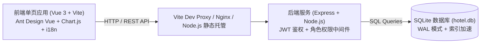
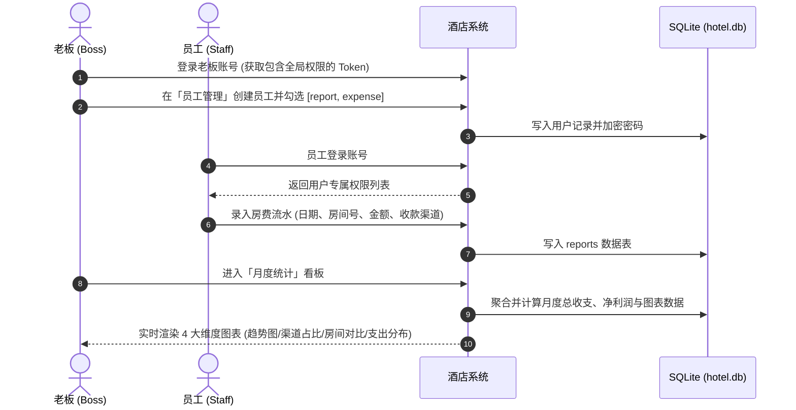

# 🏨 云宿管家 (CloudInn) - 酒店收益统计系统

<p align="center">
  
  
  
  
  
  
  
</p>

> **专为单店酒店与精品民宿量身打造的高效数字化收支管理与收益统计看板。**  
> 融合轻量免运维架构、高颜值毛玻璃（Glassmorphism）视觉设计、全终端移动端触控优化与中/英/高棉三语原生支持。

---

## 📖 目录

- [✨ 核心亮点与特色](#-核心亮点与特色)
- [🎯 业务需求与角色权限](#-业务需求与角色权限)
- [🛠️ 技术架构](#️-技术架构)
- [🚀 快速开始与本地开发](#-快速开始与本地开发)
- [⚙️ 环境变量配置](#️-环境变量配置)
- [📊 核心业务流程](#-核心业务流程)
- [🔌 接口与文档导航](#-接口与文档导航)
- [📂 项目目录结构](#-项目目录结构)
- [📱 移动端与全平台适配规范](#-移动端与全平台适配规范)

---

## ✨ 核心亮点与特色

1. **零外部数据库依赖，即开即用**
   - 采用内嵌轻量级 SQLite 数据库，单机文件持久化。
   - 生产环境默认开启 **WAL (Write-Ahead Logging)** 高并发读写模式与索引优化，读写性能提升数十倍且零运维成本。
2. **极简高效的收支流水录入**
   - **每日收入上报**：直接按交易日期、房间号、金额、收款平台录入，已彻底精简传统繁琐的班次切换限制。
   - **多支付渠道聚合**：原生支持现金（CASH）、ABA 银行转账、虚拟币 USDT（CRYPTO）、微信支付（WECHAT）及其他自定义渠道。
   - **月度成本归集**：按月账期一键录入水电、房租、宽带、洗涤、工资等日常成本。
3. **多维度全景统计看板 (4 大核心分析维度)**
   - **KPI 核心指标卡**：月度总收入、总支出、净利润、上报笔数。
   - **每日收入趋势图**（平滑折线图，支持悬浮数据提示）。
   - **收款渠道占比环形图**（实时掌握各支付方式资金沉淀）。
   - **各房间收入对比 Top 10 柱状图**（直观定位热销房型与收益表现）。
   - **支出成本分类占比饼图**（精准掌控水电、房租与人工消耗）。
4. **细粒度权限控制与员工管理**
   - 老板拥有全局管理权限，可在系统内直接创建员工账号并动态按需勾选分配 `收入上报 (report)`、`支出登记 (expense)`、`月度统计 (stats)` 模块权限。
   - 前端路由守卫与后端 API 中间件进行双重安全校验，权限失效平滑降级。
5. **现代毛玻璃 UI/UX 与暗黑/亮色双模式**
   - 细腻的高级玻璃拟态（Glassmorphism）卡片与流光动效。
   - 支持一键切换暗黑模式（Cyber Dark）与明亮模式（Crisp Light），图表与表格随主题自动实时重绘。
6. **三语原生国际化 (i18n)**
   - 针对东南亚（尤其是柬埔寨）海外酒店与民宿运营实际需求，内置 **中文（简体）**、**英文 (English)**、**高棉语 (ភាសាខ្មែរ / Khmer)** 无缝切换。

---

## 🎯 业务需求与角色权限

### 角色权限矩阵

| 功能模块 | 员工 (Employee) | 老板 (Boss) | 鉴权逻辑与说明 |
| :--- | :---: | :---: | :--- |
| **系统登录 / 注册** | 注册与登录 | 登录与环境配置 | 老板账号由环境变量或预设生成；员工自主注册或由老板在后台创建 |
| **员工管理与权限分配** | ❌ 无权访问 | ✅ 全局管理 | 老板可查看员工列表、重置密码、修改权限或一键停用/启用员工账号 |
| **每日收入上报** | 需 `report` 权限 | ✅ 全局管理 | 员工仅可查看并删除自己上报的数据，老板可查看全部员工上报记录 |
| **支出登记** | 需 `expense` 权限 | ✅ 全局管理 | 登记与查询水电费、房租、网费、工资等成本开销 |
| **月度收益看板** | 需 `stats` 权限 | ✅ 全局数据可视化 | 按月份选择并实时渲染 KPI 指标卡与 4 大维度 Chart.js 动态图表 |

---

## 🛠️ 技术架构



- **前端技术栈**：Vue 3 (Composition API / `<script setup>`) + Vite 5 + Ant Design Vue 4 + Chart.js 4 + vue-i18n 9 + vue-router 4
- **后端技术栈**：Node.js + Express 4 + SQLite3 (Native WAL Mode) + JSON Web Token (JWT) + bcryptjs
- **打包与容器化**：Vite 生产构建优化（代码自动分包与压缩） + Docker Multi-stage 构建

---

## 🚀 快速开始与本地开发

### 环境要求
- Node.js `>= 18.0.0` (推荐 Node.js 20 LTS)
- npm `>= 9.0.0` 或 yarn / pnpm

### 1. 克隆并安装依赖
```bash
git clone <repository_url> cloud-inn
cd cloud-inn

# 安装生产与开发依赖
npm install
```

### 2. 本地开发模式
```bash
# 启动 Vite 前端开发服务器（支持 HMR 热更新，端口 3000）
npm run dev

# 在另一个终端中启动后端 Express API 服务（默认监听 8088）
npm run start
```
前端开发服务启动后，浏览器访问：`http://localhost:3000`（API 请求自动由 Vite 代理至后端）。

### 3. 一键编译与本地预览
```bash
# 自动编译前端静态产物至 dist/ 目录并启动后端一体化服务
npm run preview

# 浏览器访问：http://localhost:8088
```

---

## ⚙️ 环境变量配置

系统支持通过项目根目录的 `.env` 文件或容器环境变量覆盖运行参数。可直接参考 [`.env.example`](.env.example)：

```env
# 运行端口 (默认: 8088)
PORT=8088

# JWT 鉴权密钥 (生产环境建议更换为 32 位以上高强度随机密钥)
JWT_SECRET=cloud_inn_production_jwt_key_2026_change_me

# 初始老板管理账号
BOSS_USERNAME=boss
BOSS_PASSWORD=boss12345
BOSS_NAME=酒店老板

# 数据库存储路径 (默认: ./hotel.db, Docker 容器环境: /app/data/hotel.db)
DB_PATH=./hotel.db
```

> [!TIP]
> 当后端服务启动时，会自动校验并同步环境变量中配置的老板账号，无需手动修改数据库。

---

## 📊 核心业务流程



---

## 🔌 接口与文档导航

项目配备完备的生产级开发与部署文档：

- 📘 **[RESTful API 完整规范文档 (API.md)](API.md)**：包含全部 13 个接口的 HTTP 方法、鉴权规则、请求/响应 JSON 示例及状态码规范。
- 🚀 **[生产环境部署与运维手册 (DEPLOYMENT.md)](DEPLOYMENT.md)**：包含 PM2 一体化部署、Nginx SSL 反向代理、Docker Compose 容器化部署、Systemd 系统服务、SQLite WAL 数据库热备份与故障排查指南。

### API 快速速查表

| 端点 | 请求方法 | 功能说明 | 访问权限 |
| :--- | :---: | :--- | :--- |
| `/api/health` | `GET` | 系统健康与运行状态检查 | 公开 |
| `/api/login` | `POST` | 用户账号登录并获取 JWT Token | 公开 |
| `/api/register` | `POST` | 员工账号自主注册 | 公开 |
| `/api/me` | `GET` | 获取当前登录用户的实时信息与权限 | 已登录 |
| `/api/logout` | `POST` | 退出登录 | 已登录 |
| `/api/reports` | `POST` | 提交每日房费收入上报记录 | 需 `report` 权限 |
| `/api/reports` | `GET` | 条件查询收入上报列表 (支持日期筛选) | 需 `report` 权限 |
| `/api/reports/:id` | `DELETE`| 删除指定收入记录 (本人或老板) | 需 `report` 权限 |
| `/api/expenses` | `POST` | 登记单笔经营支出成本 | 需 `expense` 权限 |
| `/api/expenses` | `GET` | 条件查询支出记录 (支持月份与日期筛选) | 需 `expense` 权限 |
| `/api/expenses/:id` | `DELETE`| 删除指定支出记录 | 需 `expense` 权限 |
| `/api/stats/monthly` | `GET` | 获取指定月份的 KPI 与 4 维度统计数据 | 需 `stats` 权限 |
| `/api/users` | `GET` | 查询全部员工账号及当前分配权限 | 老板专属 |
| `/api/users` | `POST` | 手动创建新员工账号并设定权限 | 老板专属 |
| `/api/users/:id` | `PUT` | 编辑员工姓名、密码、权限或状态 | 老板专属 |
| `/api/users/:id` | `DELETE`| 快捷切换员工账号启用/停用状态 | 老板专属 |

---

## 📂 项目目录结构

```text
cloud-inn/
├── .env.example              # 环境变量配置模板
├── .gitignore                # Git 忽略文件配置 (已排除日志、临时库与密钥)
├── API.md                    # 详尽的 RESTful API 接口规范文档
├── DEPLOYMENT.md             # 生产环境部署、备份与运维手册
├── Dockerfile                # 多阶段高优 Docker 镜像构建脚本
├── docker-compose.yml        # Docker Compose 一键编排文件 (含健康检查)
├── index.html                # 前端 HTML 挂载入口
├── package.json              # 依赖与执行脚本管理
├── README.md                 # 项目主要文档
├── server.js                 # 后端 Express 入口 (SQLite WAL, JWT, 业务 API)
├── vite.config.mjs           # Vite 生产分包构建与动态端口代理配置
└── src/                      # 前端源代码
    ├── App.vue               # 根组件 (响应式导航头、移动端抽屉、主题/语言切换)
    ├── api.js                # Axios 网络请求封装 (统一鉴权拦截与错误处理)
    ├── i18n.js               # 中/英/高棉三语国际化字典与动态切换配置
    ├── main.js               # 前端应用入口与细粒度权限路由守卫
    ├── style.css             # 精简优化的 Glassmorphism 样式系统与移动端适配
    └── views/                # 业务视图组件
        ├── Login.vue         # 登录与员工注册视图
        ├── Report.vue        # 每日房费收入上报与历史流水视图
        ├── Expense.vue       # 月度经营成本与支出登记明细视图
        ├── Stats.vue         # 月度多维度经营分析看板 (Chart.js 动态渲染)
        └── Users.vue         # 老板专属员工管理与动态权限分配视图
```

---

## 📱 移动端与全平台适配规范

- **触控优化**：移动设备屏幕宽度（`<768px`）下，所有操作按钮、选择框和表单输入框均统一保证至少 **44px** 物理触控高度，彻底避免误触。
- **表格自适应横向滑动**：在手机窄屏场景下，数据表格自动启用惯性横向滚动，表头单元格与状态徽标不换行压缩。
- **动态图表重排**：在桌面端采用双列并排的图表看板，移动端无缝降级为单列纵向排列，保证每张图表的折线与标签清晰完整。
- **暗黑主题无感适配**：全局使用 CSS 变量（`--glass-bg`, `--text-main`, `--primary-color`）与 Chart.js 动态主题监听，暗黑与明亮模式随心切换。

---

## 📄 开源与商业使用

本项目专为酒店及民宿数字化转型打造，采用轻量化可维护的工程实践架构。欢迎自由部署、二次开发与商业化落地。
