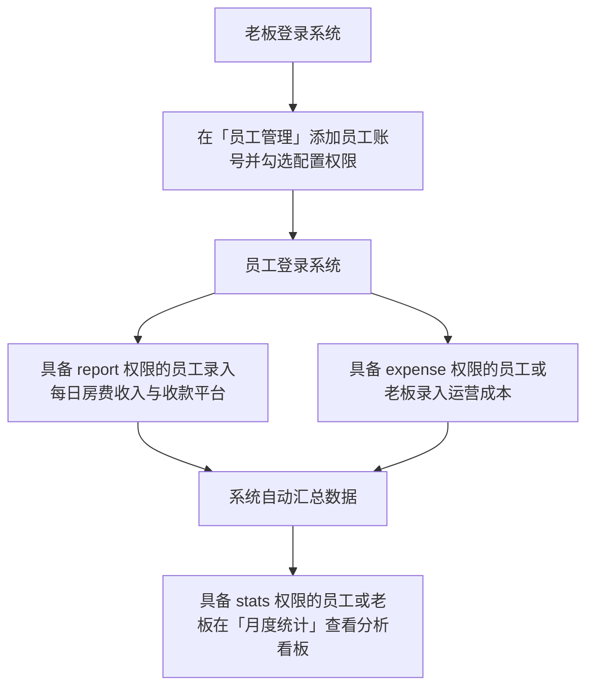

# 🏨 酒店收益统计系统 (Hotel Gemini)

> 专为单店经营场景打造的轻量级酒店收支管理与收益统计系统。支持员工录入每日房费收入、老板与管理人员分配权限、登记各项成本支出，并自动生成多维度月度收益统计分析图表。

---

## 📌 项目需求分析

### 1. 业务场景与定位
在单店酒店/民宿经营场景中，每日房费流水频繁、支付渠道多样（现金、ABA 银行、虚拟币 USDT、微信等），且各项日常成本（水电、房租、人工等）繁杂。本项目旨在提供一套简单易用、部署快捷的数字化管理工具：
- **员工端**：快速录入每日房费收入（已取消繁琐的班次限制，直接按日期与房间号录入），保证数据实时与可追溯。
- **老板端**：管控员工账号并进行**细粒度权限分配**（给不同员工赋予上报、支出、统计等模块的操作权限）、统筹录入经营成本、一键生成月度经营分析看板与 KPI 报表。

### 2. 角色与权限矩阵

| 功能模块 | 员工 (Employee) | 老板 (Boss) | 权限说明 |
| :--- | :---: | :---: | :--- |
| 登录 / 注册 | 仅注册与登录 | 登录与全局管理 | 老板使用预设/环境变量账号登录，员工注册后默认赋予上报权限 |
| 员工管理与权限分配 | ❌ 无权限 | ✅ 查看/新增/编辑权限/停用 | 老板可管理员工账号并在线勾选赋予「收入上报」、「支出登记」、「月度统计」权限 |
| 每日收入上报 | ✅ 需 `report` 权限 | ✅ 全局管理 / 删除 | 录入交易日期、房间号、收款金额、收款平台（现金 / ABA / 虚拟币 / 微信） |
| 支出登记 | ✅ 需 `expense` 权限 | ✅ 全局管理 / 删除 | 按月账期登记水电、房租、工资等成本 |
| 月度收益统计看板 | ✅ 需 `stats` 权限 | ✅ 全局数据分析图表 | 查看 KPI 卡片及 4 大维度图表分析 |

### 3. 核心功能模块划分

- **🔐 账号与认证体系**
  - 老板账号预设及环境变量动态配置。
  - 员工注册与登录验证。
  - **员工权限分配**：支持老板在员工列表中随时调整员工模块权限（收入上报、支出登记、月度统计）。
- **💰 每日收入上报模块**
  - 极简数据上报：交易日期、房间号、收款金额、收款平台（**现金 / ABA 银行 / 虚拟币 (USDT) / 微信支付 / 其他渠道**）。
  - 列表查看与记录追溯（自动关联上报人员姓名）。
- **📉 支出登记模块**
  - 按月账期归集成本：水电费、房租、网费、布草费、员工工资、其他消耗。
  - 支出明细查询与删除。
- **📊 月度统计与可视化看板**
  - **KPI 汇总卡片**：月度总收入、月度总支出、月度净利润、上报笔数。
  - **多维度统计图表 (4 张核心图表)**：
    1. **每日收入趋势图**（折线图）
    2. **收款平台占比图**（饼图/环形图，实时聚合现金、ABA、虚拟币、微信等渠道）
    3. **各房间收入对比图**（柱状图）
    4. **支出分类占比图**（饼图）
- **🌐 多语言国际化 (i18n)**
  - 三语原生支持：中文（简体）、英文 (English)、高棉语 (ភាសាខ្មែរ / Khmer)。
  - 界面语言一键无缝切换，覆盖页面按钮、表单提示、Ant Design 组件及图表图例。

---

## 🎨 UI/UX 设计与移动端适配规范

### 1. 设计风格与视觉规范
- **设计理念**：采用现代极简卡片化布局（Card-based Layout），视觉层次清晰，兼顾快速高频数据录入与沉浸式数据看板展示。
- **组件库选型**：基于 **Ant Design Vue** 构建全套响应式组件系统。
- **色彩与主题**：
  - **主色调**：商务蓝 (`#1890ff`) - 传达专业可靠与账务严谨感。
  - **状态与分类配色**：收入绿 (`#52c41a`)、支出红 (`#ff4d4f`)、利润紫 (`#722ed1`)。
  - **背景与层级**：淡灰底色 (`#f0f2f5`) 搭配高亮白底卡片，增强对比度与易读性。

### 2. 📱 移动端与多终端响应式适配
为了满足员工在手机端/平板端快速上报房费、老板随时随地在移动端查看统计看板的需求，系统进行了全方位的移动端适配：

- **自适应布局 (Responsive Grid & Flex Layout)**
  - **桌面端 (≥1024px)**：采用顶部导航 + 响应式网格（KPI 卡片 4 列展示，图表双列并排）。
  - **移动端 (<768px)**：自动转换为抽屉式导航（Drawer Menu），卡片与图表自动调整为**单列流式布局**。
- **移动端触摸与交互优化**
  - **触控区域**：表单项、按钮及下拉菜单加高（最小触控目标 ≥ 44px），防止误触。
  - **录入体验**：针对移动端优化数字键盘输入（金额/房间号）与日期选择器（DatePicker），提升前台/移动录入效率。
  - **表格响应式转换**：数据列表在移动端自动启用横向滚动或卡片化展示，解决窄屏下表格挤压错位问题。
- **图表移动端自适应 (Chart.js Mobile Adaptation)**
  - **动态缩放**：设置 `maintainAspectRatio: false`，保证图表容器随屏幕宽度自动重绘。
  - **图例与交互**：小屏设备下自动调整图例（Legend）位置至底部并优化字号，支持触摸悬停（Tooltip）查看数据详情。

---

## 🌐 多语言国际化 (i18n) 适配规范

为了适应东南亚（特别是柬埔寨）酒店与民宿经营场景，系统原生内置多语言国际化支持，支持中、英、高棉三语自由切换。

### 1. 支持语种列表

| 语言代码 | 语言名称 | 原生名称 (Native Name) | 主要应用场景 |
| :--- | :--- | :--- | :--- |
| `zh-CN` | 简体中文 | 简体中文 | 中国老板 / 管理人员使用 |
| `en-US` | 英文 | English | 外籍老板 / 跨国管理团队使用 |
| `km-KH` | 高棉语 / 柬埔寨语 | ភាសាខ្មែរ | 柬埔寨当地员工 / 前台接待使用 |

### 2. 技术实现方案
- **前端国际化框架**：基于 `vue-i18n` (v9+) 进行响应式多语言状态管理。
- **UI 组件库语言同步**：配合 Ant Design Vue 的 `<a-config-provider :locale="currentLocale">` 动态同步切换内置组件（如 DatePicker、Pagination、Modal 按钮等）的语言。
- **状态持久化与检测**：
  - 首次加载自动检测浏览器首选语言 (`navigator.language`)。
  - 用户切换语言后保存至 `localStorage.getItem('lang')`，二次访问自动读取记忆。

### 3. 字典与枚举数据国际化
- **收款平台枚举**：`CASH` (现金)、`ABA` (ABA银行)、`CRYPTO` (虚拟币 USDT)、`WECHAT` (微信支付)、`OTHER` (其他渠道)。
- **支出分类枚举**：`UTILITIES` (水电费)、`RENT` (房租)、`INTERNET` (网费宽带)、`LAUNDRY` (布草洗涤)、`SALARY` (员工工资)、`OTHER` (其他消耗)。

---

## 🚀 技术栈

- **后端**：Node.js + Express + SQLite (`hotel.db` 本地轻量级持久化)
- **前端**：Vue 3 + Ant Design Vue + Chart.js + vue-i18n (多语言国际化)
- **构建工具**：Vite

---

## 🛠️ 运行与部署指南

### 快速启动

```bash
# 安装依赖并一键启动预览（自动构建前端 + 启动后端服务）
npm install
npm run preview

# 浏览器访问：http://localhost:8088
```

### 分步操作

1. **安装依赖**
   ```bash
   npm install
   ```
2. **构建前端静态资源**
   ```bash
   npm run build
   ```
3. **启动 Express 服务**
   ```bash
   npm start
   # 服务将运行于 http://localhost:8088
   ```

### 开发模式

```bash
# 终端 1：启动 Vite 开发服务器（前端热更新，自动代理 API 到 localhost:8088）
npm run dev

# 终端 2：启动后端 Express 服务
node server.js
```

---

## 🔑 老板默认账号与环境变量配置

默认老板账号凭据如下：
- **用户名**：`boss`
- **默认密码**：`boss12345`

可通过以下环境变量灵活自定义老板账号及系统参数：

| 环境变量 | 默认值 | 说明 |
| :--- | :--- | :--- |
| `BOSS_USERNAME` | `boss` | 老板账号用户名 |
| `BOSS_PASSWORD` | `boss12345` | 老板账号密码 |
| `BOSS_NAME` | `老板` | 老板显示名称 |
| `PORT` | `8088` | 服务启动端口 |

---

## 🔄 业务使用流程



1. **账号准备与权限分配**：老板登录系统，在「员工管理」中创建员工账号，并为其分配专属模块权限（如：仅赋予上报权限，或同时勾选支出与统计权限）。
2. **收入上报**：员工登录后，在「收入上报」按交易日期、房间号、金额及平台（现金/ABA/虚拟币/微信）提交收入。
3. **支出录入**：有权限的用户按月归集与录入水电、房租、工资等经营成本。
4. **统计分析**：在「月度统计」按月份查看 KPI 卡片与多维度图表分析。

---

## 📂 项目目录结构

```text
hotel_gemini/
├── server.js             # Express + SQLite 后端服务入口及 API 实现
├── index.html            # Vite 前端 HTML 入口
├── vite.config.mjs       # Vite 构建与代理配置
├── package.json          # 项目依赖及脚本定义
├── README.md             # 项目说明文档
├── src/                  # 前端源码目录
│   ├── main.js           # Vue 3 应用入口
│   ├── App.vue            # 根组件（全局布局与动态路由导航）
│   ├── i18n.js           # 多语言国际化字典配置
│   ├── api.js            # Axios 接口封装
│   └── views/            # 页面视图组件
│       ├── Login.vue     # 登录 / 注册页面
│       ├── Report.vue    # 收入上报页面
│       ├── Expense.vue   # 支出登记页面
│       ├── Stats.vue     # 月度统计与可视化图表页面
│       └── Users.vue     # 员工账号与权限分配页面
└── dist/                 # 前端构建打包产物（运行 npm run build 后自动生成）
```

---

## 🔌 RESTful API 接口规范

| HTTP 方法 | 接口路径 | 功能说明 | 权限要求 |
| :--- | :--- | :--- | :--- |
| `POST` | `/api/login` | 用户登录 | 公开 |
| `POST` | `/api/register` | 员工账号注册 | 公开 |
| `GET` | `/api/me` | 获取当前登录用户信息与权限列表 | 已登录 |
| `POST` | `/api/logout` | 用户退出登录 | 已登录 |
| `POST` | `/api/reports` | 新增每日收入上报 | 拥有 `report` 权限或老板 |
| `GET` | `/api/reports` | 查询收入上报列表 | 拥有 `report` 权限或老板 |
| `DELETE` | `/api/reports/{id}` | 删除收入上报记录 | 记录创建人或老板 |
| `POST` | `/api/expenses` | 新增支出登记 | 拥有 `expense` 权限或老板 |
| `GET` | `/api/expenses` | 查询支出登记列表 | 拥有 `expense` 权限或老板 |
| `DELETE` | `/api/expenses/{id}` | 删除支出记录 | 拥有 `expense` 权限或老板 |
| `GET` | `/api/stats/monthly` | 获取月度收支统计与图表数据 | 拥有 `stats` 权限或老板 |
| `GET` | `/api/users` | 获取员工列表及权限 | 老板专属 |
| `POST` | `/api/users` | 新增员工账号并指定权限 | 老板专属 |
| `PUT` | `/api/users/{id}` | 修改员工信息与权限分配 | 老板专属 |
| `DELETE` | `/api/users/{id}` | 停用/启用员工账号 | 老板专属 |
